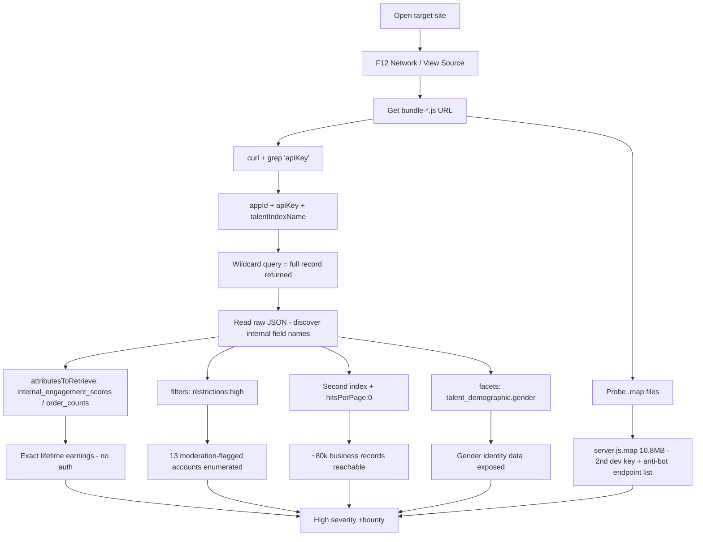

# Case Study — Algolia Search Key Over-Exposure (154,000 Records)

> **Original write-up:** [Medium — Tyrion404: From Duplicate to $$$$ Bounty](https://medium.com/@Tyrion404/from-duplicate-to-bounty-88d6511dc6db)
> **Target:** [REDACTED] talent marketplace (anonymized in the write-up)
> **The one principle:** a *public search key is meant to be public* — the **permissions granted to that key** are the actual security boundary. [[03-Web-Vulnerabilities/temp.md]] (trust boundary / two components interpreting the same data differently)

---

## TL;DR

A single Algolia **Search API key** extracted from a public JS bundle could:
- retrieve **internal financial fields** (`internal_engagement_scores`, `computed_features_order_counts`) — exact lifetime earnings per account,
- **filter by internal moderation status** (`restrictions`) → enumerate flagged accounts,
- access a **second index** (~80k business accounts, `nbHits` via `hitsPerPage: 0`),
- expose **gender identity data** via `facets` (non_binary, trans_female counts),
- plus a leaked **`server.js.map`** (10.8MB) holding a second dev key + the anti-automation bypass blueprint.

~154,000 records, **zero authentication**. Reported → closed as **Duplicate/Resolved** → re-tested a month later, still live → re-submitted → **High severity $$$$ bounty**.

---

## The Story — Why "Duplicate" became a Bounty

1. ~1 month earlier: same issue reported → closed as **Duplicate**, marked **Resolved**.
2. A month later: author re-read old reports, re-ran the exact commands **out of curiosity**.
3. **Everything still worked.** Same key, same endpoint, live data.
4. The logical signal: the report had gone through **triage** (where they said it was "being patched") *and* was marked Resolved. Both can't be true a month later. Either the fix was never deployed, or it was deployed **incompletely** (wrong / partial fix).
5. Re-documented + re-submitted → **Accepted, High severity**.

> **Meta-technique:** "Resolved" ≠ fixed. Re-verifying your old reports is a legitimate, high-yield hunting move.

---

## Scenario Walkthrough (The Chain)

### Step 1 — The key that was never hidden
JS bundles ship the search key by design (the browser must talk to Algolia directly). Grab the bundle URL from **F12 → Network**, then pull it with curl and grep:

```bash
curl -s "https://www.[DOMAIN]/dist/bundle-[HASH].js" | \
  grep -o 'appId:"[^"]*"[^}]*apiKey:"[^"]*"'
```

Output → `appId`, `apiKey`, and `talentIndexName`.

> **Foundation:** [[04-Recon/Discovering Hidden Content/Methodology.md|Discovering Hidden Content]] + [[07-CheatSheets/Recon.md#JavaScript Enumeration|JS Enumeration]]. The key itself is **not** the bug — Algolia search keys are designed to be public. The bug is what that key is allowed to retrieve.

### Step 2 — Same request the frontend sends, fields the frontend doesn't need
A normal query to the same endpoint the SPA calls thousands of times a day, but asking for internal fields:

```bash
curl -s "https://[APP_ID]-dsn.algolia.net/1/indexes/prod_[REDACTED]_talent_v0/query" \
  -H "X-Algolia-Application-Id: [APP_ID]" \
  -H "X-Algolia-API-Key: [API_KEY]" \
  -H "Content-Type: application/json" \
  -d '{"query":"","hitsPerPage":1,"attributesToRetrieve":["username","internal_engagement_scores","computed_features_order_counts"]}'
```

Response contained `internal_engagement_scores.rank_scores.lifetime_completed_gmv` (exact lifetime earnings), `l28/l364 gmv`, `order_count_all_time`. **No login required.**

> **How the field names were found:** a wildcard query (no `attributesToRetrieve`) returns **all** attributes stored in the record — that's Algolia's default. The author read the raw JSON and saw the internal field names; then wrote a clean PoC requesting them explicitly.
>
> **Frontend note:** the default response almost certainly *included* those fields for the real frontend too — the frontend just never renders them. Client-side filtering is not security; the field was retrievable at the API level.

### Step 3 — Internal moderation decisions, filterable
`restrictions` was present in the record **and** filterable:

```bash
-d '{"query":"","hitsPerPage":50,"filters":"restrictions:high","attributesToRetrieve":["username","name","restrictions"]}'
```

→ 13 named accounts flagged `restrictions:high`.

> **How he knew it's filterable:** `filters` only works on fields the developer enabled under `attributesForFaceting`. If it weren't, Algolia returns `attribute is not filterable`. It succeeded → full **enumeration of moderated accounts**.

### Step 4 — A second door, left wide open (second index)
```bash
-d '{"query":"","hitsPerPage":0}'
```
→ `{"nbHits": ~80000}`. `hitsPerPage: 0` = **volume probe** (no records, just the metadata count). Same key, second index `prod_..._business_talent_v0`.

> **Index names:** the write-up doesn't say how it was found — realistically: from the JS bundle, naming-pattern guessing (`talent_v0` → `business_talent_v0`), or the leaked source map. The **reliable** method not mentioned in the article: `GET /1/indexes` lists every index the key can reach.

### Step 5 — Highly sensitive identity data via facets
```bash
-d '{"query":"","hitsPerPage":1,"facets":["talent_demographic.gender"],"maxValuesPerFacet":10}'
```
→ facet counts for `male/female/non_binary/trans_female`.

> This was part of the *previously-reported* issue — but the earlier fix only covered the **first** index. The second stayed open. **Partial remediation = the reason the duplicate became a bounty.**

### Step 6 — The source map (escalation to blueprint)
```bash
curl -s -o /dev/null -w '%{http_code} %{size_download}\n' \
  'https://[SUBDOMAIN]/dist/server.js.map'
# 200  10800000
```
10.8MB of **server-side** TypeScript source, publicly served: contained the key again, a **second separate dev key**, and the list of endpoints **excluded from anti-automation (device fingerprinting) checks** → a ready-made blueprint to bypass the platform's defenses.

---

## Scenario Diagram



---

## Concept Mapping

- **Vulnerability class:** Sensitive data exposure via **misconfigured third-party search** (Algolia) — field-level authorization failure on a public key.
  → [[03-Web-Vulnerabilities/Access control vulnerabilities/Basic Concepts/Access Control Types.md|Access Control Types]] (the key *should* be public; the *permissions on it* are the boundary).
- **Root cause:** search key granted retrieval access to fields that should be `unretrievableAttributes`; no `attributesForFaceting` restriction; key not scoped per-index; source map deployed to production.
  → [[02-Web-Architecture/Anatomy of a Web Request.md|Trust Boundary]] — the API response is the boundary, not the UI.
- **Recon mindset:** JS bundles + Network tab are the map; wildcard query = read the whole record once, then craft precise PoCs.
  → [[04-Recon/Manual Browsing.md|Manual Browsing]] + [[04-Recon/Discovering Hidden Content/Methodology.md|Discovering Hidden Content]].
- **Testing mindset:** "If I can't see it in the UI, can I still *request* it by name?" + "does this key work on other indexes?"
  → [[03-Web-Vulnerabilities/Methodology/Access Control Testing Methodology.md|Access Control Testing Methodology]].

---

## Q&A (my questions to understand the report)

#### Q1 — Why `curl` for this? (not the browser/Burp)
- **Bypass frontend restrictions** — the request goes straight to the Algolia API, past any UI filtering.
- **Standard, copy-pasteable PoC** — triagers re-run the exact command.
- **Full control** — headers + JSON payload edited in one line.

#### Q2 — What does each payload part do?
- `"query": ""` — empty query = return results with no keyword match.
- `"hitsPerPage": 1` — one record is enough to prove the leak; minimal load.
- `"attributesToRetrieve": [...]` — the actual attack: request internal fields **by name** and see if the key may retrieve them.

#### Q3 — How did he get the bundle URL? And what is the `talentIndexName`?
- Bundle URL: not guessed. F12 → Network shows every file the browser loads (or View Source). Copy the `.js` URL → curl + grep.
- `talentIndexName` = the **index** name. An index ≈ a **table** in a database:
  `SELECT gmv FROM prod_talent_v0 WHERE ...`. Algolia **rejects any query that doesn't specify an index** — that's why the index name is half the key.

#### Q4 — Did the frontend also request these internal fields?
- Almost certainly **yes, in the raw response** — Algolia's default is to return *all* attributes. The frontend just didn't render them. So this is not "hacker asks a different field" — the fields were retrievable at the API level for everyone. **Client-side filtering ≠ security.** (This is why the author's own "same request the frontend sends" wording is important.)

#### Q5 — How did he know the internal field names exactly?
Wildcard query first (`attributesToRetrieve` omitted) → full record JSON → read the field names (`internal_engagement_scores`, `computed_features_order_counts`, `restrictions`...) → then craft the explicit PoC with those exact names.

#### Q6 — How did he know `restrictions` is filterable, and the filter syntax?
- Syntax is standard Algolia: `"filters": "field:value"` (documented, uniform across apps).
- Whether it works is the test: a non-filterable field → `attribute is not filterable` error. It succeeded → the field was also enabled in `attributesForFaceting`.

#### Q7 — Is `nbHits` always returned? How did he find the second index?
- Yes — every response carries metadata (`nbHits` = total matches). `hitsPerPage: 0` → only metadata, no records.
- Second index name: not stated in the write-up. Realistic routes: JS bundle, naming-pattern guess, or the source map. Reliable route not in the article: `GET /1/indexes`.

#### Q8 — Did the researcher "study" Algolia like a developer?
No — not dev-level depth. Hunters study docs **attacker-shaped**: the small Security Guidelines sections, the parameters that control access (`attributesToRetrieve`, `filters`, `facets`), and common misconfigurations. ~1-2h of targeted reading + experimenting on a **free test account** is enough to start hunting. The knowledge transfers: same logic applies to Meilisearch/Typesense/Elasticsearch/S3/Firebase/GraphQL introspection.

---

## New Techniques

> Skills in this write-up the repo doesn't document explicitly yet.

1. **Wildcard query as field-name discovery** — omit `attributesToRetrieve`; Algolia returns the full record. The raw JSON *is* the field dictionary.
2. **Explicit `attributesToRetrieve` as the PoC** — after discovery, name the fields to prove retrievability in a clean, triager-friendly request.
3. **`filters` as a permissions oracle** — testing `field:value` reveals not only that data exists, but whether the field was enabled for filtering (`attributesForFaceting`).
4. **`hitsPerPage: 0` volume probe** — count records (`nbHits`) without downloading any data. Light, fast, polite.
5. **Facets for sensitivity assessment** — `facets` + `maxValuesPerFacet` gives aggregate counts (gender, categories, etc.) = impact proof without dumping records.
6. **`GET /1/indexes` index enumeration** — with the key in hand, list every index it can reach. No guessing.
7. **Source-map probing** — append `.map` to bundle paths or probe `/dist/server.js.map`; production source maps (especially **server-side**) = full source + hardcoded secrets + defense-bypass map.
8. **Cross-index key testing** — a search key may be restricted to one index, or not. Always replay on sibling indexes (naming patterns `*_v0`, `*_business_*`, `*_prod_*`).
9. **Re-audit closed/resolved reports** — reproduce old reports after the "fix"; partial remediation (fix applied to one index only) is a common, high-value finding.
10. **Metadata-as-endpoint analysis** — DSN endpoint (`-dsn.algolia.net`) is the read/search surface; `.algolia.net` is the main/admin API. Knowing which surface you're on clarifies what a key *should* do.

---

## Key Takeaways

1. **Public search keys are fine; over-permissioned public keys are the bug.** Allowlist the fields a key may retrieve (`unretrievableAttributes`) and scope it per-index; rotate on exposure.
2. **Sensitive fields don't belong in the search index at all** — engagement scores, moderation flags, and demographics should never be indexed for public search.
3. **The fix must be applied everywhere** — fixing one index while a sibling stays open is an incomplete fix; that gap is a new (higher-value) report.
4. **Client-side filtering is not security** — if the API can return it, assume the frontend receives it too.
5. **Source maps never belong in production** — and a *server* source map in production is a critical finding on its own.
6. **"Resolved" is a claim, not a fact** — re-run the old commands; a live old bug after a claimed fix is your best report.
7. **Severity = volume × sensitivity × extra credentials** — 154k records + financials + identity + moderation decisions + a dev key + anti-bot bypass = High.

---

## References

- [From Duplicate to $$$$ Bounty — Tyrion404 (Medium)](https://medium.com/@Tyrion404/from-duplicate-to-bounty-88d6511dc6db)